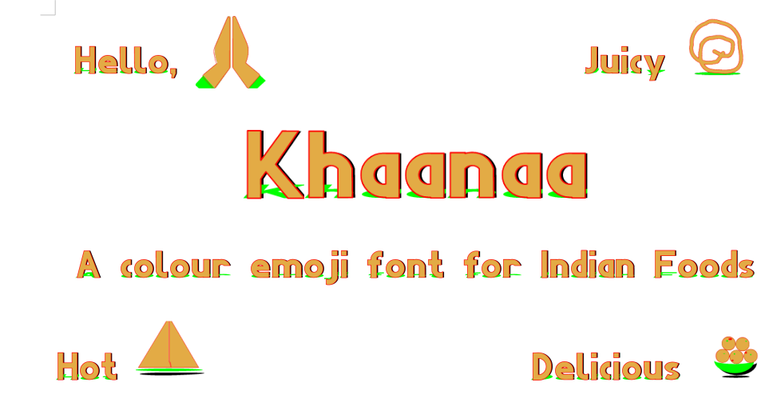

# Khaanaa Font Project

## A Color Emoji Font dedicated to Indian Food Lovers 
We Indians Love foods. A country where cuisine changes every hundred kilometeres or so, there are some favourites all over.

In this font we will showcase various famous Indian food as multicolour emojis, which can be accessed directly, or by web typograpghy as well as in Word Processors like Libreoffice Writer by switching on "dlig" discretionalry ligature feature in your web page of word processor.

## Sample 

(see [test file](https://fonts.atipra.in/khaanaa-test.html)
## Emoji list 
View [here](public/codepoints.md) 

## About 
This font is created by Dr Anirban Mitra, an amateure Typographer and Free Software Enthusiast.
## Download 
From release section

# Build instructions 
coming soon
 
## Changelog
December 2 Version 0.001 - One Emoji added 

We plan to include 1000 emojis by the time we reach version 1.000 

## License

This Font Software is licensed under the SIL Open Font License, Version 1.1.
This license is available with a FAQ at [OpenFontLicense site](https://openfontlicense.org/)