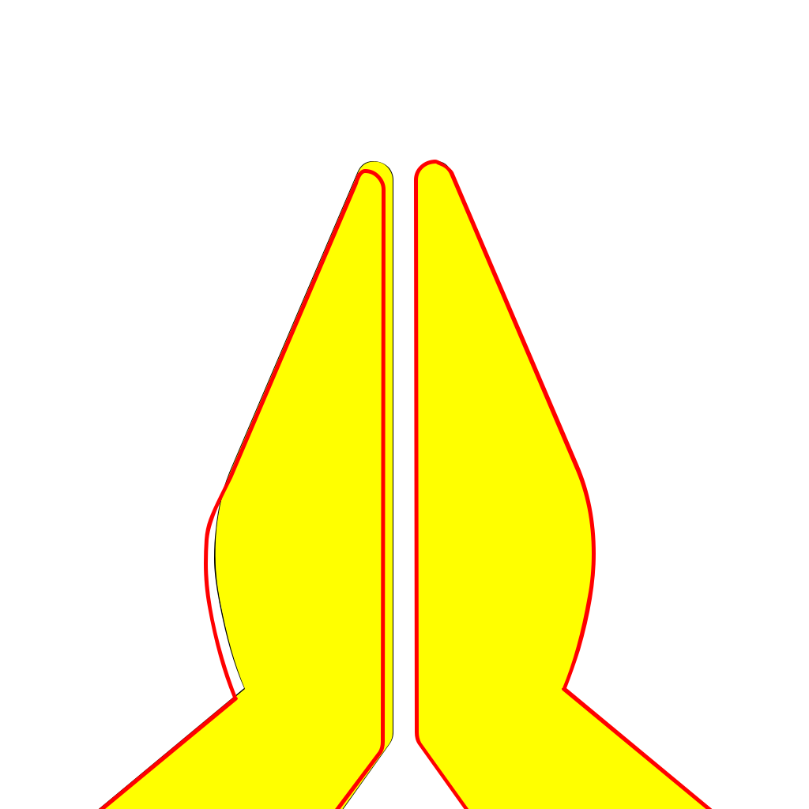
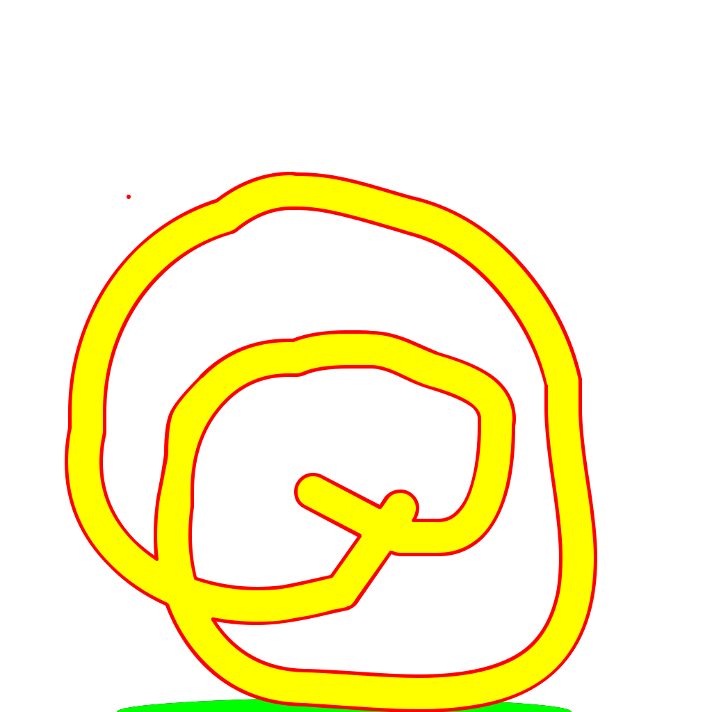
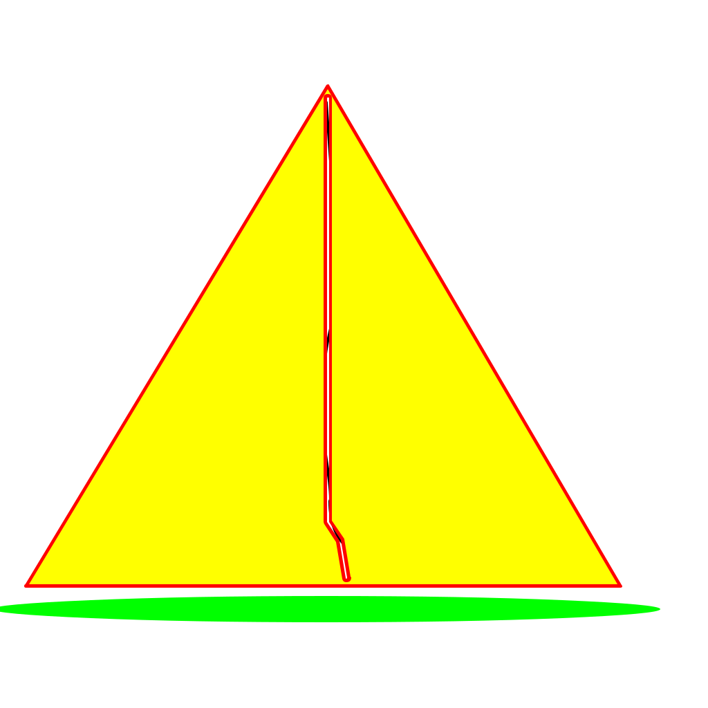
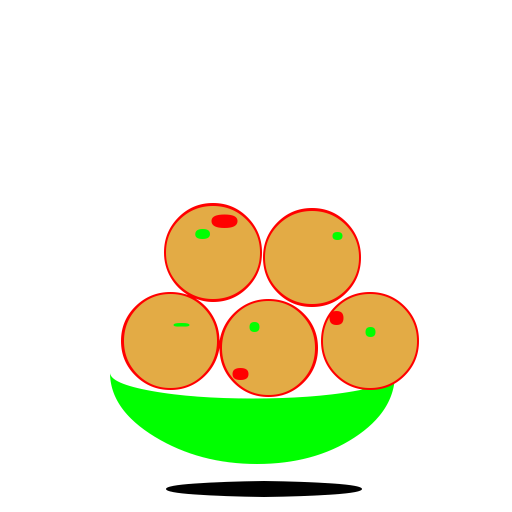

Following emojis are encoded in Unicode Private Use Area in the font 

|Sl No|shortcode|unicode hex code|picture|
|:-----|:---------:|:----------------:|-------|
|1 |namaste| &#1F64F||
|2 |jalebi| &#xE366||
|3|samosa|   &#E367||
|4|laddoo| &#E368||

