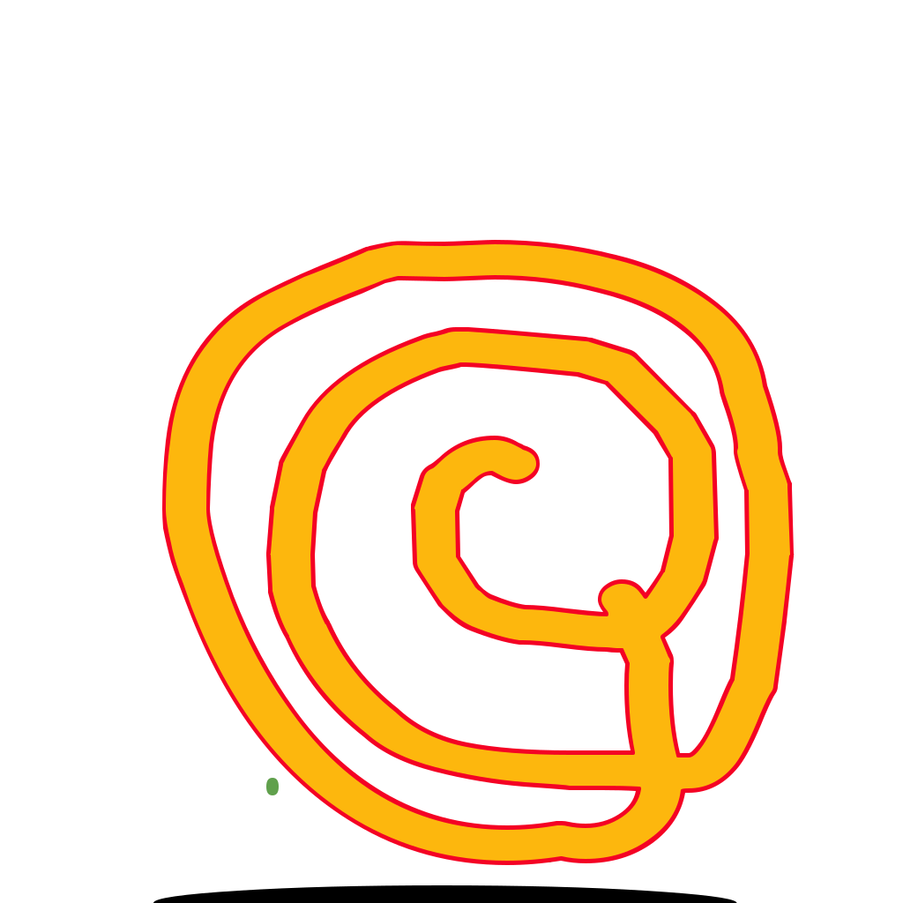
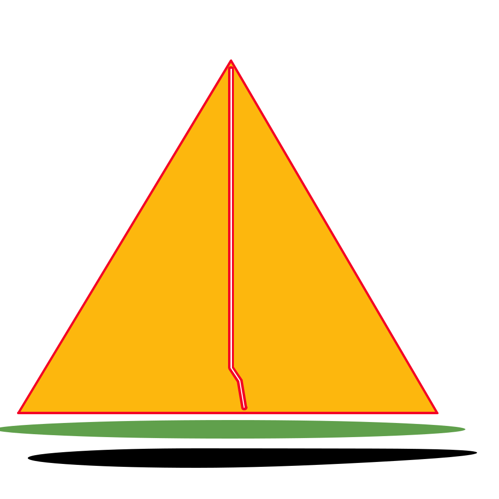
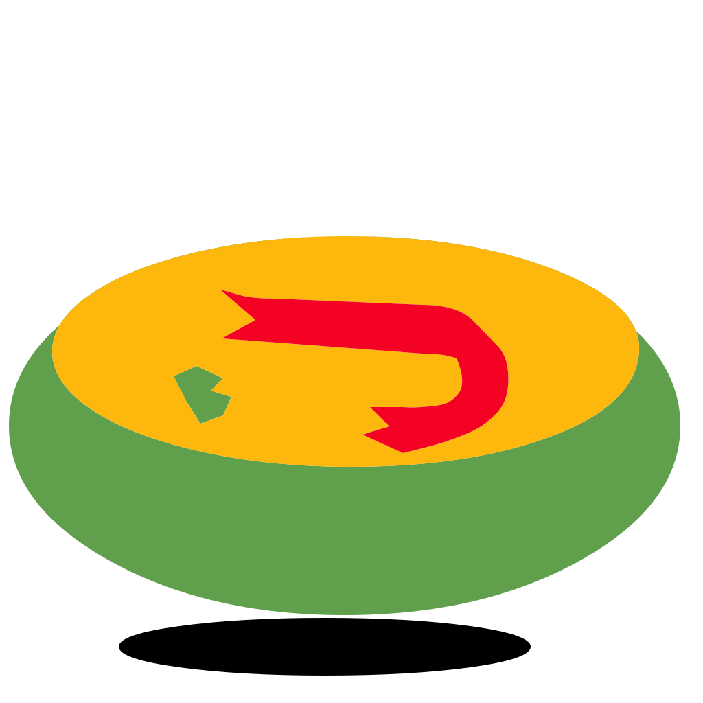
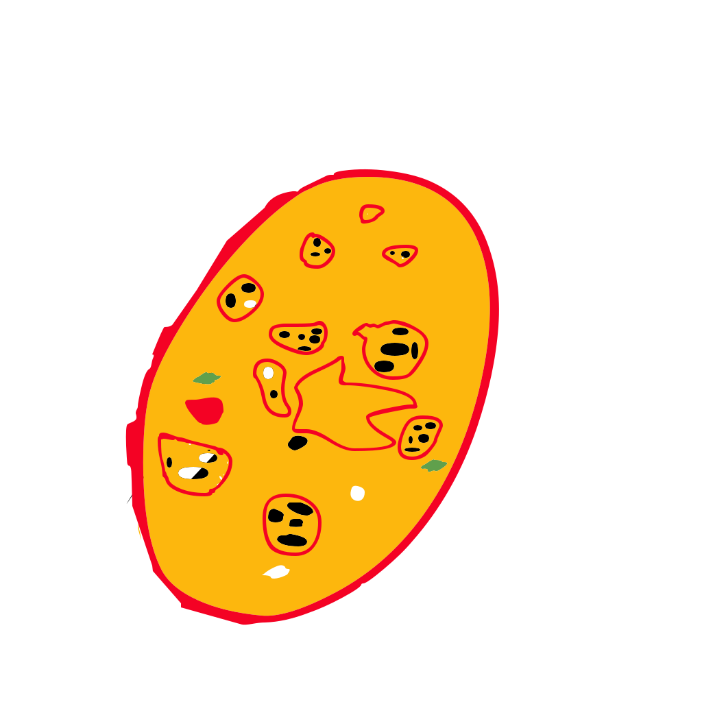

 Emojis in Khaanaa font
 ======================

 Following emojis are encoded in Unicode Private Use Area in the font and can be accessed directly by using the unicode hexcode or activating dlig feature in the text and typing out the short code. Short code also works in word processor.

 |Sl No | shortcode | unicode hex code | picture |
 |---    |----       |------            |----------|
 | 1 | namaste | &#1F64F |  |
 |2 | jalebi | &#xE366 |   |
 | 3 |  samosa |  &#xE367 |   |
 | 4 |  laddoo |  &#xE368 |  |
 | 5 |  dosa |  &#xE369 |   |
 |6| medubada| &#xE36A | |
|7|dhokla| &#xE36B | |
|8|biryani| &#xE36C | |
|9| chingrim| &#E36D ||
|10|ilish| &#E36E| |
|11|barfi|&#E36F||
|11|naan|&#E370||

